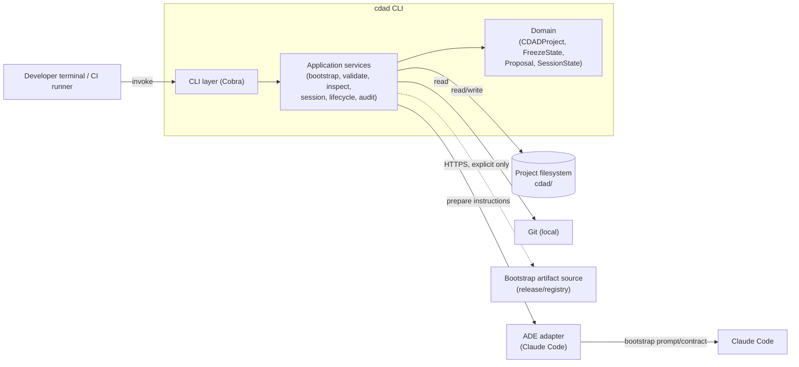
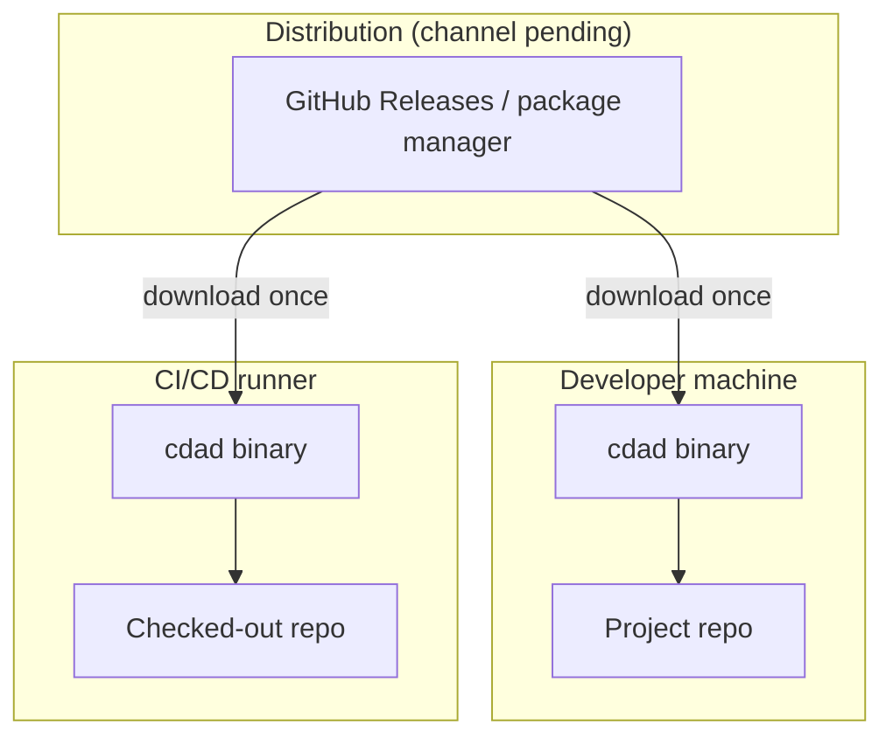

# Stack & Architecture Map

> The single view of this solution. If it is not on this page, it is not part of
> the architecture. Every approved architectural change updates this file in the
> same commit as the ADR that approves it.

- **Last verified:** `2026-09-16` — run the `cdad-audit` skill to refresh
- **Governing ADRs:** ADR-001

---

## 1. Stack at a glance

One row per layer. If a cell is empty, the decision has not been made — say so
rather than leaving a plausible guess in place.

| Layer | Technology | Version | Locked by |
|---|---|---|---|
| Language | Go | pending — not pinned in source design | ADR-001 |
| Runtime | none — statically compiled native binary | n/a | ADR-001 |
| Application framework | Cobra (CLI framework) | pending — not pinned in source design | ADR-001 |
| Compute model | standalone CLI executable (local process / CI runner) | n/a | ADR-001 |
| Datastore (primary) | none — project filesystem (`cdad/` artifacts) | n/a | ADR-001 |
| Datastore (cache) | none | n/a | |
| Messaging / events | in-process lifecycle event model (no external broker) | pending — exact event schema not finalized | |
| Identity & authz | none — local CLI, no auth surface | n/a | |
| Secrets | none stored by the CLI; must never log/expose credentials | n/a | |
| IaC | none | n/a | |
| CI/CD | pending — distribution channel not decided (GitHub Releases / Homebrew / Scoop / winget under consideration) | | |
| Observability | pending — not specified in source design | | |
| Testing | Go standard library `testing` | n/a | ADR-001 |

"Locked by" points at the ADR that made the decision. A row with no ADR is a
decision nobody made on purpose — treat it as technical debt.

---

## 2. Component map

What talks to what, and over which protocol. Keep it to components that exist;
this is not a roadmap.



Label every edge with its protocol. An unlabelled edge is where paradigm drift
starts: sync and async look identical in a box diagram and behave nothing alike.

---

## 3. Deployment topology

Where each component actually runs, and what the trust boundaries are.



There is no managed cloud deployment: the CLI ships as a binary that runs
wherever it is invoked. No network access is required for `status`,
`inspect`, `validate`, or `audit` — only bootstrap acquisition, version
discovery, and updates need it (see `constraints.md`).

---

## 4. Observability

Where signals come from and where they land. This view answers "if it breaks at
3am, what do I look at" — keep it accurate or it is worse than absent.

Not specified in the source design. The CLI is a local/CI tool, not a
running service, so traditional logs/metrics/traces observability may not
apply the same way — leave this pending rather than inventing an
observability stack the source never decided.

| Signal | Emitted by | Collected via | Stored in | Retention |
|---|---|---|---|---|
| Logs | | | | |
| Metrics | | | | |
| Traces | | | | |
| Audit events | `cdad audit` | n/a | `cdad/CDAD-COMPLETION.md`, audit reports | append-only |

**What is alerted on, and who receives it:**

| Condition | Threshold | Routed to |
|---|---|---|

---

## 5. Dependency rules

The boundaries the code must respect. This table is what makes drift
detectable — without it, "Service A calls the database directly" is an opinion.

| Module | May depend on | Must not depend on |
|---|---|---|
| `cmd/cdad` | Application Services | Infrastructure directly, Domain internals |
| `internal/integration` (ADE adapters) | Domain (read-only) | CDAD governance logic |
| `internal/lifecycle`, `internal/validator`, `internal/session` | Domain | `internal/integration` (any ADE-specific code) |

See `architecture.md` → *Modules and boundaries* for the full table.

---

## 6. Map change log

Every row here corresponds to an accepted ADR. If an architectural change
happened without a row, the governance loop was skipped.

| Date | ADR | What changed in this map |
|---|---|---|
| 2026-09-16 | ADR-001 | Initial stack drafted from source design (`CDAD_CLI_v3_Technical_Design.md`) during `cdad-bootstrap` |

---

## 7. Drift signals

Paths outside `cdad/` that carry architectural weight even though they are not
themselves governed. `detect-drift.py` and the `cdad-audit` sweep read this
block to know what to watch; without it, the detector is blind. One line per
signal: a glob, then the decision or view it guards.

```cdad-drift-signals
# <glob>  ->  <what it guards, referencing a view above or an ADR>
```

Leave the block empty (as above) rather than inventing paths that do not
carry a real decision yet. A signal with no matching decision above is noise.
No Go source exists yet — populate this once `cmd/` and `internal/` are real.

---
Governance: L0. Read-only for AI agents. Changes require an approved ADR and are
applied by the Solution Designer.
